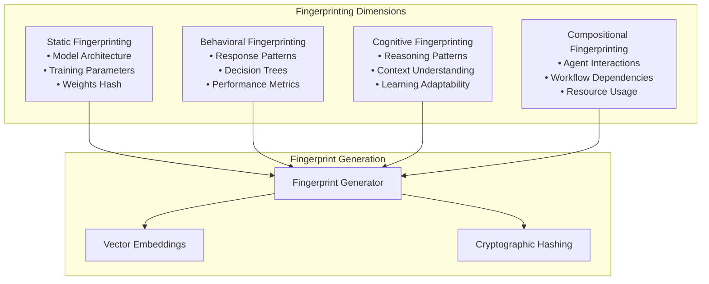
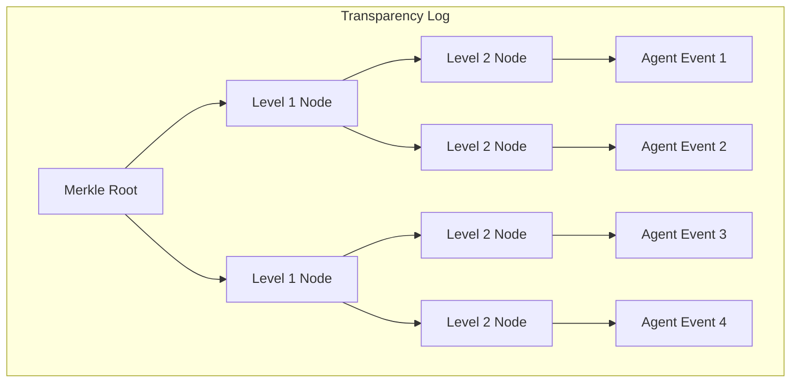
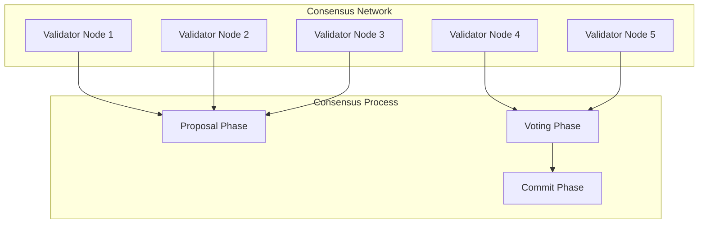
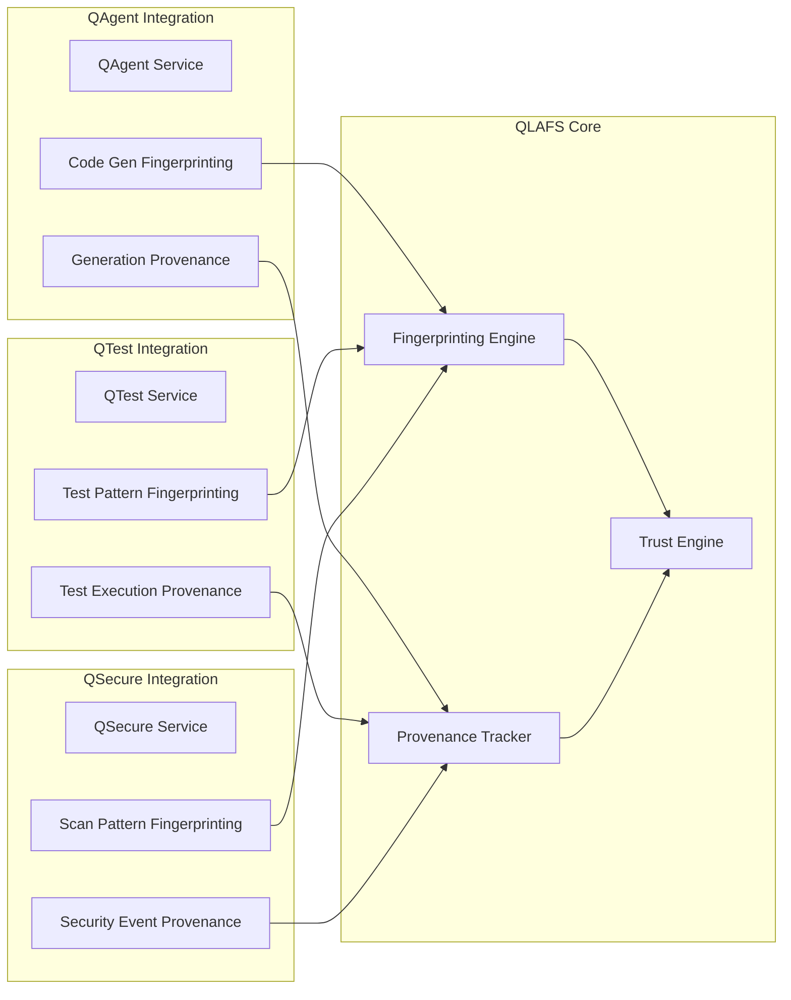
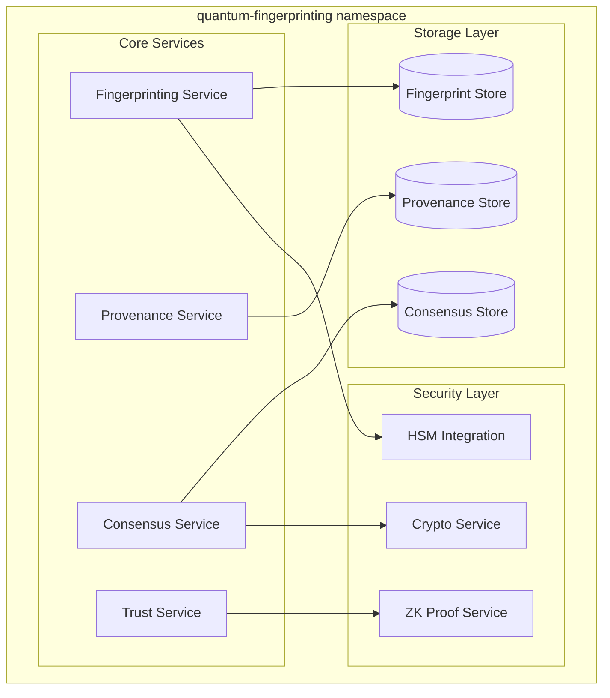

# QLAFS Integration Architecture

## Table of Contents
1. [Overview](#overview)
2. [QLAFS Core Components](#qlafs-core-components)
3. [Integration Points](#integration-points)
4. [Deployment Architecture](#deployment-architecture)
5. [Security Model](#security-model)
6. [API Specifications](#api-specifications)
7. [Implementation Roadmap](#implementation-roadmap)

## Overview

The QuantumLayer Agent Fingerprinting & Provenance System (QLAFS) provides comprehensive AI agent governance, fingerprinting, and trust scoring capabilities for the Quantum Suite platform. QLAFS ensures transparency, accountability, and compliance in AI-driven DevSecOps workflows.

### Core Value Propositions
- **AI Agent Authenticity**: Multi-dimensional fingerprinting of AI agents
- **Provenance Tracking**: Complete lineage and audit trails for AI decisions
- **Trust Scoring**: Dynamic trust assessment based on performance and behavior
- **Compliance**: Zero-knowledge proofs for privacy-preserving audits
- **Transparency**: Immutable logs with cryptographic verification

## QLAFS Core Components

### 1. Multi-Dimensional Fingerprinting Engine



### 2. Transparency Log with Merkle Trees



### 3. Byzantine Consensus Validation



### 4. Trust Scoring Engine

```yaml
Trust Score Components:
  - Performance Metrics (40%)
    - Accuracy: 0.95
    - Consistency: 0.92
    - Response Time: 0.88
  
  - Security Metrics (30%)
    - Vulnerability Exposure: 0.98
    - Compliance Score: 0.94
    - Anomaly Detection: 0.91
  
  - Behavioral Metrics (20%)
    - Pattern Stability: 0.89
    - Drift Detection: 0.93
    - Resource Efficiency: 0.87
  
  - Community Metrics (10%)
    - Peer Validation: 0.92
    - Usage Adoption: 0.85
    - Feedback Score: 0.88

Final Trust Score: 0.916 (Excellent)
```

## Integration Points

### 1. Quantum Suite Module Integration



### 2. Event-Driven Integration

```go
// QLAFS Domain Events Extension
type AgentFingerprintGenerated struct {
    BaseDomainEvent
    AgentID      string                 `json:"agent_id"`
    Fingerprint  AgentFingerprint      `json:"fingerprint"`
    Dimensions   []string              `json:"dimensions"`
    Confidence   float64               `json:"confidence"`
    Metadata     map[string]interface{} `json:"metadata"`
}

type ProvenanceRecorded struct {
    BaseDomainEvent
    ProvenanceID string                 `json:"provenance_id"`
    AgentID      string                 `json:"agent_id"`
    Operation    string                 `json:"operation"`
    LineageDAG   LineageNode           `json:"lineage_dag"`
    MerkleProof  []string              `json:"merkle_proof"`
}

type TrustScoreUpdated struct {
    BaseDomainEvent
    AgentID       string                 `json:"agent_id"`
    PreviousScore float64               `json:"previous_score"`
    NewScore      float64               `json:"new_score"`
    Factors       map[string]float64    `json:"factors"`
    Confidence    float64               `json:"confidence"`
}
```

### 3. Temporal Workflow Integration

```go
// QLAFS Workflow Activities
type QlafsWorkflowActivities struct {
    fingerprintingService FingerprintingService
    provenanceService     ProvenanceService
    trustService         TrustService
}

func (a *QlafsWorkflowActivities) GenerateAgentFingerprint(
    ctx context.Context, 
    agentID string, 
    dimensions []string,
) (*AgentFingerprint, error) {
    // Implementation
}

func (a *QlafsWorkflowActivities) RecordProvenance(
    ctx context.Context,
    agentID string,
    operation Operation,
) (*ProvenanceRecord, error) {
    // Implementation
}

func (a *QlafsWorkflowActivities) UpdateTrustScore(
    ctx context.Context,
    agentID string,
    metrics TrustMetrics,
) (*TrustScore, error) {
    // Implementation
}
```

## Deployment Architecture

### 1. Kubernetes Namespace Structure

```yaml
# Namespace: quantum-fingerprinting
apiVersion: v1
kind: Namespace
metadata:
  name: quantum-fingerprinting
  labels:
    name: quantum-fingerprinting
    part-of: quantum-suite
    component: ai-governance
    security-level: high
```

### 2. QLAFS Services Deployment



### 3. Multi-Region Deployment

```yaml
Deployment Strategy:
  Primary Region: us-west-2
    - Full QLAFS deployment
    - Master consensus nodes
    - Primary HSM cluster
  
  Secondary Regions: 
    - us-east-1: Replica with local consensus
    - eu-west-1: Replica with local consensus
    - asia-pacific-1: Replica with local consensus
  
  Consensus Synchronization:
    - Global consensus for trust scores
    - Regional consensus for local operations
    - Cross-region merkle tree synchronization
```

## Security Model

### 1. Zero-Knowledge Proof Implementation

```go
type ZKProofConfig struct {
    Scheme     string `json:"scheme"`     // "groth16", "plonk", "stark"
    Curve      string `json:"curve"`      // "bn256", "bls12-381"
    Circuit    string `json:"circuit"`    // Path to circuit definition
    TrustedSetup bool `json:"trusted_setup"`
}

type ComplianceProof struct {
    ProofData    []byte    `json:"proof_data"`
    PublicInputs []string  `json:"public_inputs"`
    Verification bool      `json:"verification"`
    Timestamp    time.Time `json:"timestamp"`
}
```

### 2. HSM Key Management

```yaml
HSM Configuration:
  Provider: "aws-cloudhsm" # or "azure-dedicated-hsm", "google-cloud-hsm"
  Key Types:
    - Signing Keys: ECDSA P-256
    - Encryption Keys: AES-256-GCM
    - Root Keys: RSA-4096
  
  Key Rotation:
    Schedule: "monthly"
    Backup: "encrypted-s3"
    Recovery: "multi-party-computation"
```

### 3. Byzantine Fault Tolerance

```yaml
Consensus Parameters:
  Algorithm: "PBFT" # Practical Byzantine Fault Tolerance
  Validators: 5 # Minimum for production
  Fault Tolerance: 1 # Can tolerate 1 faulty node
  Timeout: "30s"
  Block Size: 1000 # Operations per block
```

## API Specifications

### 1. Fingerprinting APIs

```yaml
/api/v1/qlafs/fingerprint:
  post:
    summary: Generate agent fingerprint
    requestBody:
      required: true
      content:
        application/json:
          schema:
            $ref: '#/components/schemas/FingerprintRequest'
    responses:
      '200':
        description: Fingerprint generated successfully
        content:
          application/json:
            schema:
              $ref: '#/components/schemas/FingerprintResponse'

/api/v1/qlafs/fingerprint/{agentId}:
  get:
    summary: Retrieve agent fingerprint
    parameters:
      - name: agentId
        in: path
        required: true
        schema:
          type: string
    responses:
      '200':
        description: Fingerprint retrieved
        content:
          application/json:
            schema:
              $ref: '#/components/schemas/AgentFingerprint'
```

### 2. Provenance APIs

```yaml
/api/v1/qlafs/provenance:
  post:
    summary: Record provenance event
    requestBody:
      required: true
      content:
        application/json:
          schema:
            $ref: '#/components/schemas/ProvenanceEvent'
    responses:
      '201':
        description: Provenance recorded
        content:
          application/json:
            schema:
              $ref: '#/components/schemas/ProvenanceRecord'

/api/v1/qlafs/provenance/{agentId}/lineage:
  get:
    summary: Retrieve agent lineage DAG
    parameters:
      - name: agentId
        in: path
        required: true
        schema:
          type: string
    responses:
      '200':
        description: Lineage retrieved
        content:
          application/json:
            schema:
              $ref: '#/components/schemas/LineageDAG'
```

### 3. Trust Scoring APIs

```yaml
/api/v1/qlafs/trust/{agentId}:
  get:
    summary: Get agent trust score
    parameters:
      - name: agentId
        in: path
        required: true
        schema:
          type: string
    responses:
      '200':
        description: Trust score retrieved
        content:
          application/json:
            schema:
              $ref: '#/components/schemas/TrustScore'

/api/v1/qlafs/trust/batch:
  post:
    summary: Update multiple trust scores
    requestBody:
      required: true
      content:
        application/json:
          schema:
            $ref: '#/components/schemas/BatchTrustUpdate'
    responses:
      '200':
        description: Trust scores updated
```

## Implementation Roadmap

### Phase 1: Foundation (Weeks 1-4)
- [ ] QLAFS namespace and basic infrastructure
- [ ] Fingerprinting service implementation
- [ ] Basic provenance tracking
- [ ] Integration with existing domain events
- [ ] HSM setup and key management

### Phase 2: Core Features (Weeks 5-8)
- [ ] Multi-dimensional fingerprinting
- [ ] Merkle tree transparency log
- [ ] Basic trust scoring algorithm
- [ ] API implementation
- [ ] Vector database integration

### Phase 3: Advanced Features (Weeks 9-12)
- [ ] Byzantine consensus implementation
- [ ] Zero-knowledge proof integration
- [ ] Advanced trust scoring with ML
- [ ] Cross-region deployment
- [ ] Compliance reporting

### Phase 4: Enterprise Features (Weeks 13-16)
- [ ] Advanced lineage visualization
- [ ] Real-time monitoring dashboard
- [ ] Automated compliance workflows
- [ ] Performance optimization
- [ ] Security audit and penetration testing

### Integration Checkpoints

#### Checkpoint 1: Basic Integration
- QLAFS services deployed
- Basic fingerprinting working
- Integration with QAgent completed

#### Checkpoint 2: Core Functionality
- All modules integrated
- Trust scoring operational
- Provenance tracking complete

#### Checkpoint 3: Production Ready
- Security features implemented
- Performance optimized
- Documentation complete

---

This integration architecture ensures QLAFS becomes a foundational component of the Quantum Suite platform, providing enterprise-grade AI governance and trust management capabilities.