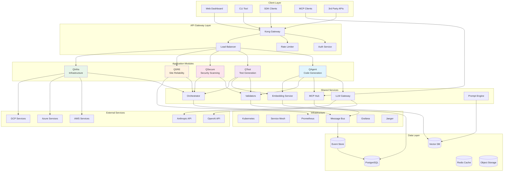
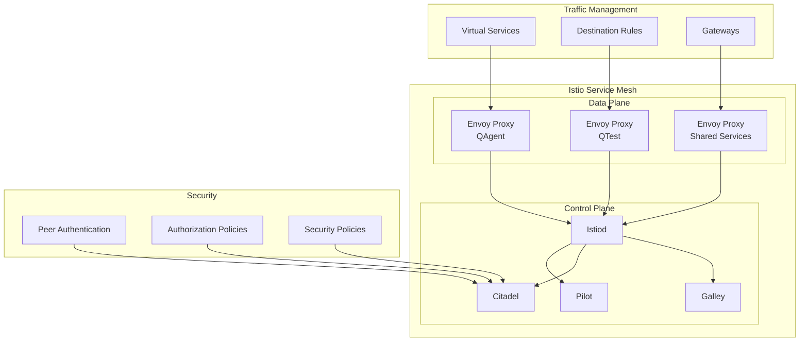
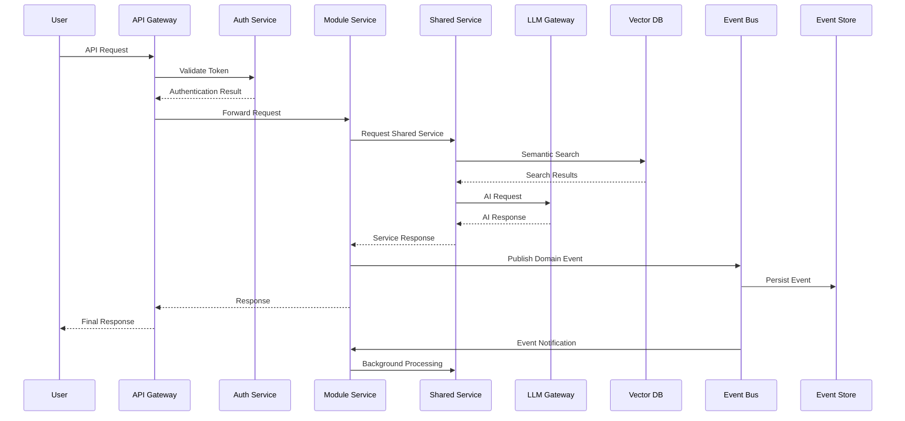
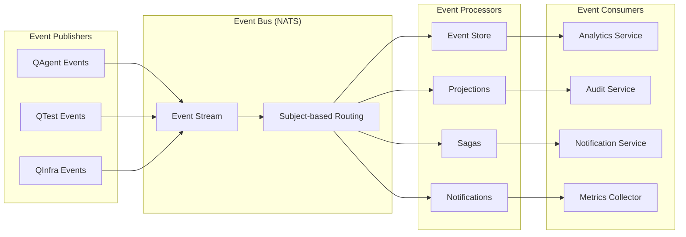
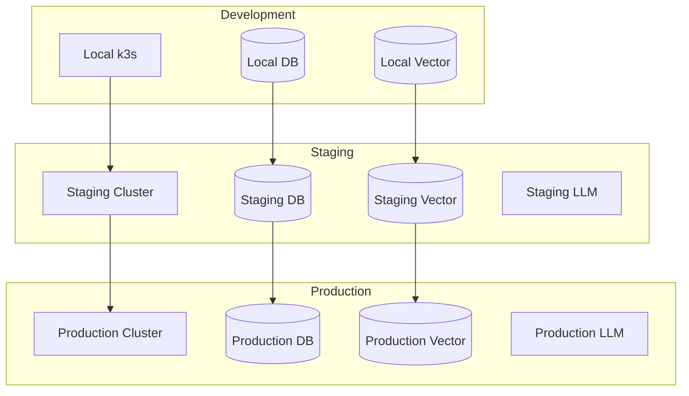
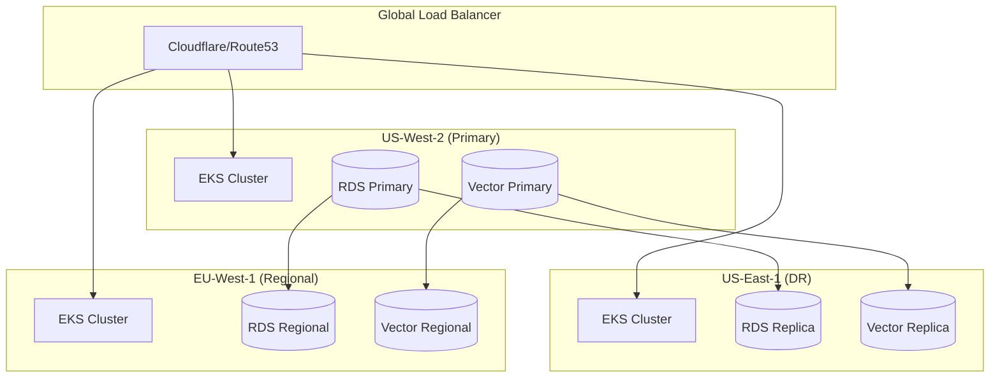
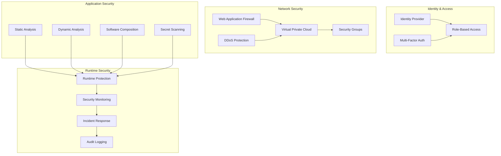

# Quantum Suite System Architecture Overview

## Table of Contents
1. [Executive Summary](#executive-summary)
2. [System Architecture](#system-architecture)
3. [Component Overview](#component-overview)
4. [Data Flow Architecture](#data-flow-architecture)
5. [Technology Stack](#technology-stack)
6. [Deployment Architecture](#deployment-architecture)
7. [Security Architecture](#security-architecture)
8. [Performance Considerations](#performance-considerations)

## Executive Summary

Quantum Suite is a comprehensive DevSecOps platform that leverages AI to automate software development, testing, security, and operations. The platform is built using microservices architecture with event-driven communication, designed for scale, reliability, and extensibility.

### Key Architectural Principles

- **Domain-Driven Design (DDD)**: Clear domain boundaries and ubiquitous language
- **Event-Driven Architecture (EDA)**: Loose coupling through asynchronous communication
- **CQRS + Event Sourcing**: Separation of read/write operations with audit trail
- **Microservices**: Independent, deployable services with single responsibility
- **Cloud-Native**: Kubernetes-first with multi-cloud support
- **Security by Design**: Zero-trust architecture with defense in depth

## System Architecture

### High-Level Architecture Diagram

### Service Mesh Architecture

## Component Overview

### Core Modules

#### QAgent - AI Code Generation
- **Purpose**: Natural language to code transformation
- **Key Features**:
  - Multi-language code generation
  - Context-aware suggestions
  - Self-criticism and improvement loops
  - Meta-prompt optimization
- **Technology**: Go, OpenAI/Anthropic APIs, Vector embeddings
- **Scaling**: Horizontal auto-scaling based on queue depth

#### QTest - Intelligent Testing
- **Purpose**: Automated test generation and execution
- **Key Features**:
  - Unit/Integration/E2E test generation
  - Coverage analysis and optimization
  - Mutation testing
  - Performance test generation
- **Technology**: Go, Tree-sitter, Coverage tools
- **Scaling**: Parallel test execution with worker pools

#### QSecure - Security Operations
- **Purpose**: Automated security scanning and remediation
- **Key Features**:
  - SAST/DAST scanning
  - Container security analysis
  - Vulnerability management
  - Compliance monitoring
- **Technology**: Go, Security scanners, Vulnerability databases
- **Scaling**: Distributed scanning with result aggregation

#### QSRE - Site Reliability Engineering
- **Purpose**: Intelligent monitoring and incident response
- **Key Features**:
  - Anomaly detection
  - Automated incident response
  - Chaos engineering
  - SLO management
- **Technology**: Go, Prometheus, Grafana, ML models
- **Scaling**: Event-driven processing with auto-scaling

#### QInfra - Infrastructure Orchestration
- **Purpose**: Multi-cloud infrastructure management
- **Key Features**:
  - Infrastructure as Code
  - Golden image management
  - Disaster recovery automation
  - Compliance enforcement
- **Technology**: Go, Terraform, Cloud APIs
- **Scaling**: Region-based deployment with global coordination

### Shared Services

#### LLM Gateway
- **Purpose**: Centralized AI model access and management
- **Features**:
  - Multi-provider support (OpenAI, Anthropic, Local)
  - Intelligent routing and load balancing
  - Token management and cost optimization
  - Response caching and validation
- **Architecture**: Stateless service with Redis caching
- **Scaling**: Auto-scaling with circuit breakers

#### MCP Hub
- **Purpose**: Model Context Protocol coordination
- **Features**:
  - Service discovery and registration
  - Protocol translation and routing
  - Resource sharing and access control
  - Event distribution
- **Architecture**: Event-driven with persistent connections
- **Scaling**: Clustered deployment with leader election

#### Vector Database Service
- **Purpose**: Semantic search and similarity matching
- **Features**:
  - Multi-provider vector storage (Qdrant, Weaviate, pgvector)
  - Embedding generation and indexing
  - Hybrid search (vector + keyword)
  - Performance optimization
- **Architecture**: Distributed with read replicas
- **Scaling**: Horizontal partitioning with consistent hashing

#### Orchestration Engine
- **Purpose**: Workflow coordination and state management
- **Features**:
  - Complex workflow execution
  - State management and persistence
  - Error handling and retries
  - Resource allocation
- **Architecture**: Event-sourced with CQRS
- **Scaling**: Actor model with distributed state

## Data Flow Architecture

### Request Flow Diagram

### Event Flow Architecture

## Technology Stack

### Programming Languages
- **Primary**: Go 1.21+ (Backend services, CLI tools)
- **Frontend**: TypeScript/React (Web dashboard)
- **Scripts**: Shell/Python (Automation, tooling)

### Databases
- **Primary**: PostgreSQL 15+ (Transactional data, Event store)
- **Cache**: Redis 7+ (Session, Application cache)
- **Vector**: Qdrant, Weaviate, pgvector (Semantic search)
- **Time Series**: InfluxDB (Metrics, monitoring data)

### Message Systems
- **Event Bus**: NATS (Event streaming, pub/sub)
- **Queue**: NATS JetStream (Job processing, workflows)
- **Streaming**: Apache Kafka (High-volume event streams)

### Container Platform
- **Runtime**: Docker (Containerization)
- **Orchestration**: Kubernetes 1.28+ (Container orchestration)
- **Service Mesh**: Istio (Traffic management, security)
- **Registry**: Harbor (Container registry)

### Observability
- **Metrics**: Prometheus (Metrics collection)
- **Visualization**: Grafana (Dashboards, alerting)
- **Tracing**: Jaeger (Distributed tracing)
- **Logging**: Fluentd + Elasticsearch/Loki (Log aggregation)

### Infrastructure
- **IaC**: Terraform (Infrastructure provisioning)
- **Config**: Helm (Kubernetes configuration)
- **Secrets**: HashiCorp Vault (Secret management)
- **Registry**: Harbor (Artifact registry)

### AI/ML Services
- **LLM APIs**: OpenAI GPT-4, Anthropic Claude
- **Local Models**: Ollama, vLLM (Self-hosted models)
- **Embeddings**: OpenAI ada-002, Sentence Transformers
- **Vector Search**: Qdrant, Weaviate, Milvus

## Deployment Architecture

### Multi-Environment Strategy

### Multi-Region Deployment

## Security Architecture

### Zero-Trust Security Model

### Data Protection Strategy

- **Encryption at Rest**: AES-256 for databases, object storage
- **Encryption in Transit**: TLS 1.3 for all communications
- **Key Management**: Hardware Security Modules (HSM)
- **Data Classification**: Automatic PII detection and masking
- **Backup Encryption**: End-to-end encrypted backups
- **Compliance**: SOC2, ISO27001, GDPR compliance built-in

## Performance Considerations

### Scalability Targets
- **Concurrent Users**: 10,000+ simultaneous users
- **API Throughput**: 100,000+ requests/second
- **Vector Search**: <100ms p95 response time
- **Code Generation**: <30s p95 response time
- **Database**: 100,000+ transactions/second

### Optimization Strategies
- **Horizontal Scaling**: Auto-scaling based on metrics
- **Caching**: Multi-layer caching strategy
- **Connection Pooling**: Optimized database connections
- **Async Processing**: Event-driven background processing
- **Resource Optimization**: CPU/Memory tuning per service

### Monitoring & Alerting
- **SLA Monitoring**: 99.9% availability target
- **Performance Metrics**: Real-time performance tracking
- **Error Tracking**: Comprehensive error monitoring
- **Cost Monitoring**: Usage-based cost optimization
- **Capacity Planning**: Predictive scaling based on trends

---

This system architecture provides a solid foundation for building a scalable, secure, and maintainable DevSecOps platform that can grow with business needs while maintaining high performance and reliability standards.