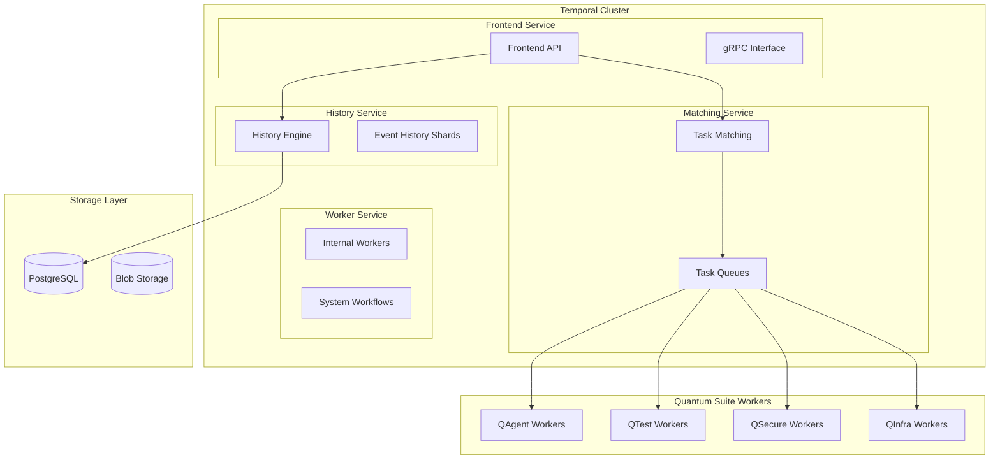
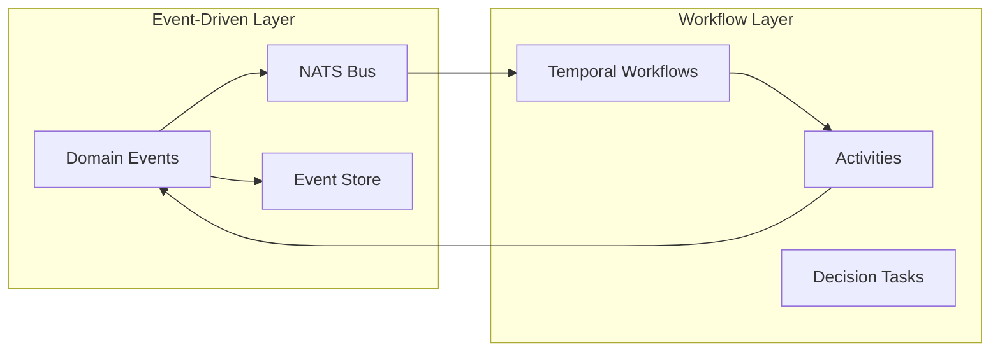

# Temporal Workflow Integration

## Table of Contents
1. [Overview](#overview)
2. [Temporal Architecture](#temporal-architecture)
3. [Workflow Patterns](#workflow-patterns)
4. [Integration with Quantum Modules](#integration-with-quantum-modules)
5. [Deployment Configuration](#deployment-configuration)
6. [Workflow Examples](#workflow-examples)
7. [Monitoring and Observability](#monitoring-and-observability)

## Overview

Temporal provides durable workflow orchestration for the Quantum Suite platform, enabling complex multi-step processes with built-in reliability, state management, and error recovery. This integration complements the existing event-driven architecture with powerful workflow capabilities.

### Key Benefits
- **Durability**: Workflows survive service restarts and failures
- **Reliability**: Built-in retry policies and error handling
- **Visibility**: Complete workflow execution history and state
- **Scalability**: Horizontal scaling with task queue partitioning
- **Versioning**: Safe workflow updates with backward compatibility

## Temporal Architecture

### Core Components



### Integration with Event Sourcing



## Workflow Patterns

### 1. Sequential Processing Pattern

```go
// Sequential workflow for code generation pipeline
func CodeGenerationWorkflow(ctx workflow.Context, req CodeGenerationRequest) (*CodeGenerationResult, error) {
    logger := workflow.GetLogger(ctx)
    
    // Activity options with retries
    ao := workflow.ActivityOptions{
        StartToCloseTimeout: 10 * time.Minute,
        RetryPolicy: &temporal.RetryPolicy{
            InitialInterval:    time.Second,
            BackoffCoefficient: 2.0,
            MaximumInterval:    100 * time.Second,
            MaximumAttempts:    3,
        },
    }
    ctx = workflow.WithActivityOptions(ctx, ao)
    
    // Step 1: Parse and validate prompt
    var parsedPrompt ParsedPrompt
    err := workflow.ExecuteActivity(ctx, ParsePromptActivity, req.Prompt).Get(ctx, &parsedPrompt)
    if err != nil {
        logger.Error("Failed to parse prompt", "error", err)
        return nil, err
    }
    
    // Step 2: Generate code using LLM
    var generatedCode GeneratedCode
    err = workflow.ExecuteActivity(ctx, GenerateCodeActivity, parsedPrompt).Get(ctx, &generatedCode)
    if err != nil {
        logger.Error("Failed to generate code", "error", err)
        return nil, err
    }
    
    // Step 3: Validate and test generated code
    var validationResult ValidationResult
    err = workflow.ExecuteActivity(ctx, ValidateCodeActivity, generatedCode).Get(ctx, &validationResult)
    if err != nil {
        logger.Error("Failed to validate code", "error", err)
        return nil, err
    }
    
    // Step 4: Record fingerprint and provenance (QLAFS integration)
    var fingerprintResult FingerprintResult
    err = workflow.ExecuteActivity(ctx, RecordFingerprintActivity, generatedCode).Get(ctx, &fingerprintResult)
    if err != nil {
        logger.Error("Failed to record fingerprint", "error", err)
        return nil, err
    }
    
    return &CodeGenerationResult{
        Code:        generatedCode,
        Validation:  validationResult,
        Fingerprint: fingerprintResult,
    }, nil
}
```

### 2. Human-in-the-Loop Pattern

```go
// Workflow with human approval for infrastructure changes
func InfraProvisionWorkflow(ctx workflow.Context, req InfraProvisionRequest) (*InfraProvisionResult, error) {
    logger := workflow.GetLogger(ctx)
    ao := workflow.ActivityOptions{
        StartToCloseTimeout: 30 * time.Minute,
        RetryPolicy: &temporal.RetryPolicy{
            InitialInterval:    time.Second,
            BackoffCoefficient: 2.0,
            MaximumInterval:    100 * time.Second,
            MaximumAttempts:    5,
        },
    }
    ctx = workflow.WithActivityOptions(ctx, ao)
    
    // Step 1: Plan infrastructure changes
    var plan InfraPlan
    err := workflow.ExecuteActivity(ctx, PlanInfraActivity, req).Get(ctx, &plan)
    if err != nil {
        return nil, err
    }
    
    // Step 2: Human approval for high-impact changes
    if plan.Impact == "HIGH" {
        var approved bool
        err := workflow.ExecuteActivity(ctx, RequestApprovalActivity, plan).Get(ctx, &approved)
        if err != nil {
            return nil, err
        }
        
        if !approved {
            return &InfraProvisionResult{
                Status: "REJECTED",
                Reason: "Human approval denied",
            }, nil
        }
        
        // Wait for additional confirmation with timeout
        selector := workflow.NewSelector(ctx)
        approvalChannel := workflow.GetSignalChannel(ctx, "approval-confirmation")
        
        var confirmation ApprovalConfirmation
        selector.AddReceive(approvalChannel, func(c workflow.ReceiveChannel, more bool) {
            c.Receive(ctx, &confirmation)
        })
        
        // Timeout after 24 hours
        ctx, cancel := workflow.WithTimeout(ctx, 24*time.Hour)
        defer cancel()
        
        selector.Select(ctx)
        
        if !confirmation.Confirmed {
            return &InfraProvisionResult{
                Status: "TIMEOUT",
                Reason: "Approval confirmation timeout",
            }, nil
        }
    }
    
    // Step 3: Execute infrastructure provisioning
    var result InfraProvisionResult
    err = workflow.ExecuteActivity(ctx, ProvisionInfraActivity, plan).Get(ctx, &result)
    if err != nil {
        // Compensating transaction - rollback
        logger.Error("Provisioning failed, initiating rollback", "error", err)
        workflow.ExecuteActivity(ctx, RollbackInfraActivity, plan)
        return nil, err
    }
    
    return &result, nil
}
```

### 3. Saga Pattern for Distributed Transactions

```go
// Saga workflow for complete DevSecOps pipeline
func DevSecOpsPipelineWorkflow(ctx workflow.Context, req PipelineRequest) (*PipelineResult, error) {
    logger := workflow.GetLogger(ctx)
    
    var compensations []func() error
    defer func() {
        // Execute compensations in reverse order if needed
        for i := len(compensations) - 1; i >= 0; i-- {
            compensations[i]()
        }
    }()
    
    ao := workflow.ActivityOptions{
        StartToCloseTimeout: 15 * time.Minute,
        RetryPolicy: &temporal.RetryPolicy{
            InitialInterval:    time.Second,
            BackoffCoefficient: 2.0,
            MaximumInterval:    100 * time.Second,
            MaximumAttempts:    3,
        },
    }
    ctx = workflow.WithActivityOptions(ctx, ao)
    
    // Step 1: Generate code (QAgent)
    var codeResult CodeGenerationResult
    err := workflow.ExecuteActivity(ctx, GenerateCodeActivity, req.CodeRequest).Get(ctx, &codeResult)
    if err != nil {
        return nil, err
    }
    compensations = append(compensations, func() error {
        workflow.ExecuteActivity(ctx, CleanupCodeActivity, codeResult)
        return nil
    })
    
    // Step 2: Generate tests (QTest)
    var testResult TestGenerationResult
    err = workflow.ExecuteActivity(ctx, GenerateTestsActivity, codeResult).Get(ctx, &testResult)
    if err != nil {
        return nil, err
    }
    compensations = append(compensations, func() error {
        workflow.ExecuteActivity(ctx, CleanupTestsActivity, testResult)
        return nil
    })
    
    // Step 3: Security scan (QSecure)
    var securityResult SecurityScanResult
    err = workflow.ExecuteActivity(ctx, SecurityScanActivity, codeResult).Get(ctx, &securityResult)
    if err != nil {
        return nil, err
    }
    
    if securityResult.HasCriticalVulnerabilities {
        logger.Error("Critical vulnerabilities found, aborting pipeline")
        return nil, fmt.Errorf("critical security vulnerabilities detected")
    }
    
    // Step 4: Deploy infrastructure (QInfra)
    var infraResult InfraDeployResult
    err = workflow.ExecuteActivity(ctx, DeployInfraActivity, req.InfraRequest).Get(ctx, &infraResult)
    if err != nil {
        return nil, err
    }
    compensations = append(compensations, func() error {
        workflow.ExecuteActivity(ctx, DestroyInfraActivity, infraResult)
        return nil
    })
    
    // Step 5: Deploy application
    var deployResult DeployResult
    err = workflow.ExecuteActivity(ctx, DeployApplicationActivity, DeployRequest{
        Code:   codeResult,
        Tests:  testResult,
        Infra:  infraResult,
    }).Get(ctx, &deployResult)
    if err != nil {
        return nil, err
    }
    
    // Step 6: Setup monitoring (QSRE)
    var monitorResult MonitoringResult
    err = workflow.ExecuteActivity(ctx, SetupMonitoringActivity, deployResult).Get(ctx, &monitorResult)
    if err != nil {
        logger.Warn("Failed to setup monitoring", "error", err)
        // Non-critical, continue
    }
    
    // Clear compensations on success
    compensations = nil
    
    return &PipelineResult{
        Code:       codeResult,
        Tests:      testResult,
        Security:   securityResult,
        Infra:      infraResult,
        Deployment: deployResult,
        Monitoring: monitorResult,
    }, nil
}
```

## Integration with Quantum Modules

### QAgent Integration

```go
// QAgent workflow activities
type QAgentActivities struct {
    llmGateway     LLMGateway
    vectorDB       VectorDatabase
    qlafsClient    QlafsClient
}

func (a *QAgentActivities) GenerateCodeActivity(ctx context.Context, req CodeRequest) (*GeneratedCode, error) {
    // Retrieve similar code patterns from vector DB
    patterns, err := a.vectorDB.Search(req.Prompt, 5)
    if err != nil {
        return nil, err
    }
    
    // Generate code using LLM
    code, err := a.llmGateway.GenerateCode(LLMRequest{
        Prompt:   req.Prompt,
        Language: req.Language,
        Context:  patterns,
    })
    if err != nil {
        return nil, err
    }
    
    // Record fingerprint
    fingerprint, err := a.qlafsClient.GenerateFingerprint(FingerprintRequest{
        AgentID: "qagent-v1",
        Data:    code,
        Type:    "code-generation",
    })
    if err != nil {
        // Log error but don't fail the workflow
        log.Warn("Failed to generate fingerprint", "error", err)
    }
    
    return &GeneratedCode{
        Code:        code.Content,
        Language:    req.Language,
        Fingerprint: fingerprint,
        Metadata:    code.Metadata,
    }, nil
}
```

### QTest Integration

```go
// QTest workflow activities
type QTestActivities struct {
    testGenerator TestGenerator
    testRunner    TestRunner
    qlafsClient   QlafsClient
}

func (a *QTestActivities) GenerateTestsActivity(ctx context.Context, code GeneratedCode) (*TestSuite, error) {
    // Generate tests based on code
    tests, err := a.testGenerator.GenerateTests(TestGenerationRequest{
        SourceCode: code.Code,
        Language:   code.Language,
        Coverage:   0.85, // Target 85% coverage
    })
    if err != nil {
        return nil, err
    }
    
    // Record test generation fingerprint
    fingerprint, err := a.qlafsClient.GenerateFingerprint(FingerprintRequest{
        AgentID: "qtest-v1",
        Data:    tests,
        Type:    "test-generation",
    })
    if err != nil {
        log.Warn("Failed to generate test fingerprint", "error", err)
    }
    
    return &TestSuite{
        Tests:       tests.Tests,
        Coverage:    tests.EstimatedCoverage,
        Fingerprint: fingerprint,
    }, nil
}

func (a *QTestActivities) ExecuteTestsActivity(ctx context.Context, suite TestSuite) (*TestResults, error) {
    results, err := a.testRunner.RunTests(TestExecutionRequest{
        Tests:   suite.Tests,
        Timeout: 10 * time.Minute,
    })
    if err != nil {
        return nil, err
    }
    
    return &TestResults{
        Passed:   results.PassedCount,
        Failed:   results.FailedCount,
        Coverage: results.ActualCoverage,
        Results:  results.DetailedResults,
    }, nil
}
```

## Deployment Configuration

### Kubernetes Deployment

```yaml
# Temporal Server Deployment
apiVersion: apps/v1
kind: Deployment
metadata:
  name: temporal-server
  namespace: quantum-system
spec:
  replicas: 3
  selector:
    matchLabels:
      app: temporal-server
  template:
    metadata:
      labels:
        app: temporal-server
    spec:
      containers:
      - name: temporal-server
        image: temporalio/temporal:1.22.0
        ports:
        - containerPort: 7233
          name: frontend
        - containerPort: 7234
          name: history
        - containerPort: 7235
          name: matching
        - containerPort: 7239
          name: worker
        env:
        - name: DB
          value: postgresql
        - name: DB_PORT
          value: "5432"
        - name: POSTGRES_USER
          valueFrom:
            secretKeyRef:
              name: quantum-secrets
              key: POSTGRES_USER
        - name: POSTGRES_PWD
          valueFrom:
            secretKeyRef:
              name: quantum-secrets
              key: POSTGRES_PASSWORD
        - name: POSTGRES_SEEDS
          value: "postgresql.quantum-data.svc.cluster.local"
        - name: DYNAMIC_CONFIG_FILE_PATH
          value: "/etc/temporal/config/dynamicconfig/development-sql.yaml"
        volumeMounts:
        - name: config
          mountPath: /etc/temporal/config
        resources:
          requests:
            memory: "512Mi"
            cpu: "200m"
          limits:
            memory: "2Gi"
            cpu: "1000m"
      volumes:
      - name: config
        configMap:
          name: temporal-config

---
apiVersion: v1
kind: Service
metadata:
  name: temporal-frontend
  namespace: quantum-system
spec:
  selector:
    app: temporal-server
  ports:
  - port: 7233
    targetPort: 7233
    name: frontend
  - port: 7234
    targetPort: 7234
    name: history
  - port: 7235
    targetPort: 7235
    name: matching
  type: ClusterIP
```

### Worker Deployment

```yaml
# Quantum Suite Workers
apiVersion: apps/v1
kind: Deployment
metadata:
  name: quantum-temporal-workers
  namespace: quantum-services
spec:
  replicas: 5
  selector:
    matchLabels:
      app: quantum-temporal-workers
  template:
    metadata:
      labels:
        app: quantum-temporal-workers
    spec:
      containers:
      - name: worker
        image: quantum-suite/temporal-workers:latest
        env:
        - name: TEMPORAL_HOST
          value: "temporal-frontend.quantum-system.svc.cluster.local:7233"
        - name: TASK_QUEUE
          value: "quantum-workflows"
        - name: POSTGRES_URL
          valueFrom:
            secretKeyRef:
              name: quantum-secrets
              key: DATABASE_URL
        - name: REDIS_URL
          valueFrom:
            secretKeyRef:
              name: quantum-secrets
              key: REDIS_URL
        resources:
          requests:
            memory: "256Mi"
            cpu: "100m"
          limits:
            memory: "1Gi"
            cpu: "500m"
```

## Workflow Examples

### Complete Code Generation Pipeline

```go
// Complete workflow definition
func CompleteCodePipelineWorkflow(ctx workflow.Context, req CompletePipelineRequest) (*PipelineResult, error) {
    logger := workflow.GetLogger(ctx)
    
    // Configure workflow with long timeout for human interactions
    ctx = workflow.WithWorkflowTimeout(ctx, 48*time.Hour)
    
    ao := workflow.ActivityOptions{
        StartToCloseTimeout: 15 * time.Minute,
        RetryPolicy: &temporal.RetryPolicy{
            InitialInterval:    time.Second,
            BackoffCoefficient: 2.0,
            MaximumInterval:    100 * time.Second,
            MaximumAttempts:    3,
        },
    }
    ctx = workflow.WithActivityOptions(ctx, ao)
    
    var result PipelineResult
    
    // Phase 1: Code Generation
    logger.Info("Starting code generation phase")
    err := workflow.ExecuteActivity(ctx, GenerateCodeActivity, req.CodeRequest).Get(ctx, &result.Code)
    if err != nil {
        return nil, fmt.Errorf("code generation failed: %w", err)
    }
    
    // Phase 2: Test Generation and Execution
    logger.Info("Starting test generation phase")
    err = workflow.ExecuteActivity(ctx, GenerateTestsActivity, result.Code).Get(ctx, &result.Tests)
    if err != nil {
        return nil, fmt.Errorf("test generation failed: %w", err)
    }
    
    err = workflow.ExecuteActivity(ctx, ExecuteTestsActivity, result.Tests).Get(ctx, &result.TestResults)
    if err != nil {
        return nil, fmt.Errorf("test execution failed: %w", err)
    }
    
    // Fail if tests don't pass
    if result.TestResults.Failed > 0 {
        return nil, fmt.Errorf("tests failed: %d failures", result.TestResults.Failed)
    }
    
    // Phase 3: Security Scanning
    logger.Info("Starting security scan phase")
    err = workflow.ExecuteActivity(ctx, SecurityScanActivity, result.Code).Get(ctx, &result.SecurityScan)
    if err != nil {
        return nil, fmt.Errorf("security scan failed: %w", err)
    }
    
    // Human review for critical vulnerabilities
    if result.SecurityScan.CriticalCount > 0 {
        logger.Info("Critical vulnerabilities found, requesting human review")
        
        // Send notification
        workflow.ExecuteActivity(ctx, NotifySecurityTeamActivity, result.SecurityScan)
        
        // Wait for security review signal
        var securityApproval SecurityApproval
        signalCh := workflow.GetSignalChannel(ctx, "security-review-complete")
        
        // Timeout after 24 hours
        ctx, cancel := workflow.WithTimeout(ctx, 24*time.Hour)
        defer cancel()
        
        signalCh.Receive(ctx, &securityApproval)
        
        if !securityApproval.Approved {
            return nil, fmt.Errorf("security review failed: %s", securityApproval.Reason)
        }
    }
    
    // Phase 4: Infrastructure Provisioning (if needed)
    if req.NeedsInfrastructure {
        logger.Info("Starting infrastructure provisioning phase")
        err = workflow.ExecuteActivity(ctx, ProvisionInfraActivity, req.InfraRequest).Get(ctx, &result.Infrastructure)
        if err != nil {
            return nil, fmt.Errorf("infrastructure provisioning failed: %w", err)
        }
    }
    
    // Phase 5: Deployment
    logger.Info("Starting deployment phase")
    err = workflow.ExecuteActivity(ctx, DeployApplicationActivity, DeployRequest{
        Code:           result.Code,
        Tests:          result.Tests,
        Infrastructure: result.Infrastructure,
    }).Get(ctx, &result.Deployment)
    if err != nil {
        // Rollback infrastructure if deployment fails
        if req.NeedsInfrastructure {
            workflow.ExecuteActivity(ctx, RollbackInfraActivity, result.Infrastructure)
        }
        return nil, fmt.Errorf("deployment failed: %w", err)
    }
    
    // Phase 6: Post-deployment verification
    logger.Info("Starting post-deployment verification")
    err = workflow.ExecuteActivity(ctx, VerifyDeploymentActivity, result.Deployment).Get(ctx, &result.Verification)
    if err != nil {
        return nil, fmt.Errorf("deployment verification failed: %w", err)
    }
    
    logger.Info("Pipeline completed successfully")
    return &result, nil
}
```

## Monitoring and Observability

### Temporal Web UI Configuration

```yaml
apiVersion: apps/v1
kind: Deployment
metadata:
  name: temporal-ui
  namespace: quantum-system
spec:
  replicas: 1
  selector:
    matchLabels:
      app: temporal-ui
  template:
    metadata:
      labels:
        app: temporal-ui
    spec:
      containers:
      - name: temporal-ui
        image: temporalio/ui:2.21.0
        ports:
        - containerPort: 8080
        env:
        - name: TEMPORAL_ADDRESS
          value: "temporal-frontend.quantum-system.svc.cluster.local:7233"
        - name: TEMPORAL_CORS_ORIGINS
          value: "http://localhost:3000,https://quantum-suite.io"
---
apiVersion: v1
kind: Service
metadata:
  name: temporal-ui
  namespace: quantum-system
spec:
  selector:
    app: temporal-ui
  ports:
  - port: 8080
    targetPort: 8080
  type: ClusterIP
```

### Metrics Integration

```go
// Custom metrics for Temporal workflows
type WorkflowMetrics struct {
    prometheus.MetricSet
    
    WorkflowStarted    prometheus.Counter
    WorkflowCompleted  prometheus.Counter
    WorkflowFailed     prometheus.Counter
    WorkflowDuration   prometheus.Histogram
    ActivityDuration   prometheus.Histogram
}

func (m *WorkflowMetrics) RecordWorkflowStart(workflowType string) {
    m.WorkflowStarted.WithLabelValues(workflowType).Inc()
}

func (m *WorkflowMetrics) RecordWorkflowComplete(workflowType string, duration time.Duration) {
    m.WorkflowCompleted.WithLabelValues(workflowType).Inc()
    m.WorkflowDuration.WithLabelValues(workflowType).Observe(duration.Seconds())
}
```

This integration provides a robust foundation for orchestrating complex DevSecOps workflows with reliability, observability, and maintainability built-in.