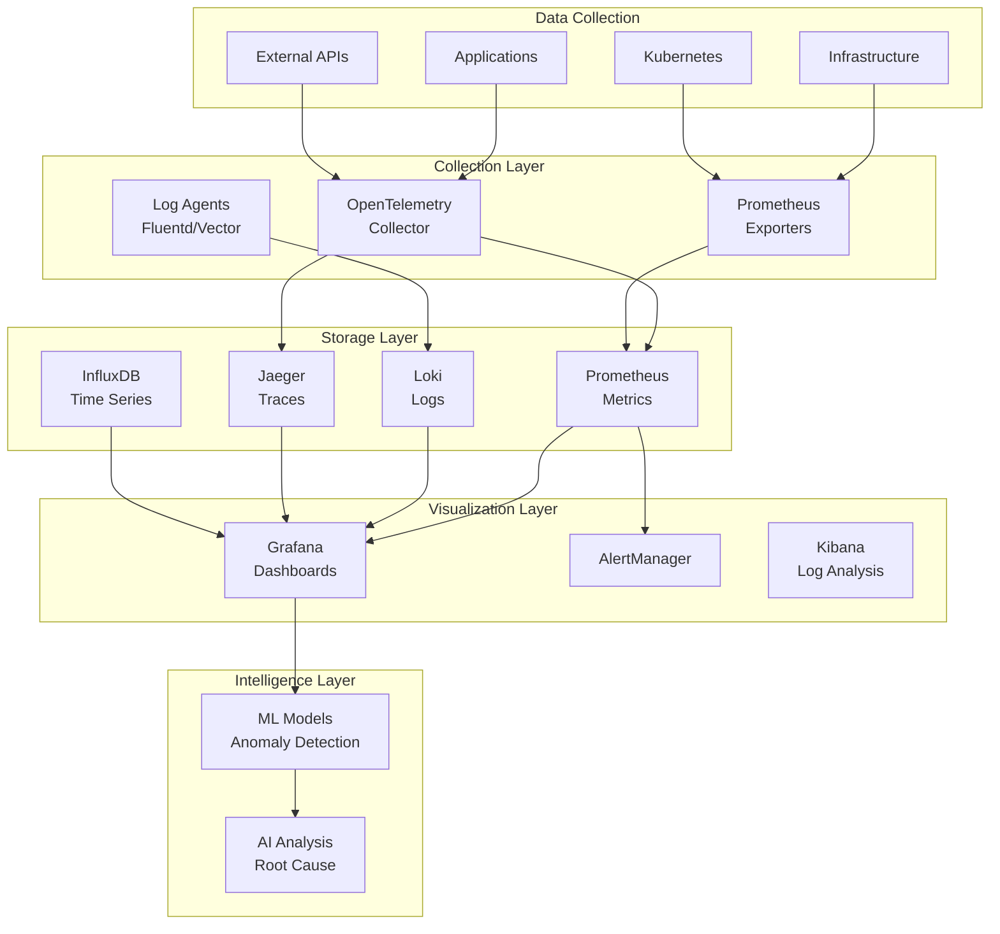
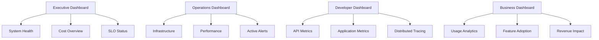
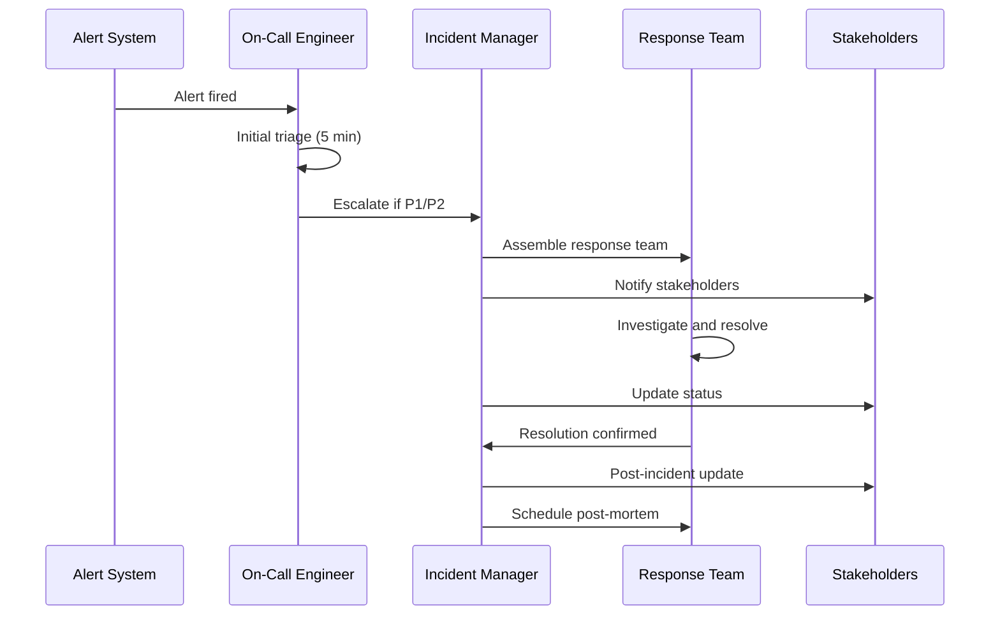

# Quantum Suite Monitoring & Metrics Strategy

## Table of Contents
1. [Overview](#overview)
2. [Observability Stack](#observability-stack)
3. [Metrics Framework](#metrics-framework)
4. [Key Performance Indicators](#key-performance-indicators)
5. [Alerting Strategy](#alerting-strategy)
6. [Dashboard Design](#dashboard-design)
7. [SLO Management](#slo-management)
8. [Incident Response](#incident-response)

## Overview

The Quantum Suite monitoring strategy follows the three pillars of observability:
- **Metrics**: Quantitative measurements of system behavior
- **Logs**: Structured event records for debugging and audit
- **Traces**: Request flow visualization across distributed services

### Monitoring Objectives
- 🎯 **Proactive Issue Detection**: Identify problems before users experience them
- 📊 **Performance Optimization**: Understand system bottlenecks and optimization opportunities
- 🔧 **Operational Excellence**: Provide actionable insights for operations teams
- 💰 **Cost Management**: Track resource usage and optimization opportunities
- 📈 **Business Intelligence**: Correlate technical metrics with business outcomes

## Observability Stack

### Core Components



### Technology Stack

| Component | Technology | Purpose |
|-----------|------------|---------|
| **Metrics Collection** | Prometheus, OpenTelemetry | Time-series metrics gathering |
| **Log Aggregation** | Loki, Elasticsearch | Centralized log storage and search |
| **Distributed Tracing** | Jaeger, Zipkin | Request flow visualization |
| **Visualization** | Grafana, Kibana | Dashboards and data exploration |
| **Alerting** | AlertManager, PagerDuty | Incident notification and escalation |
| **APM** | OpenTelemetry | Application performance monitoring |
| **Infrastructure** | Node Exporter, cAdvisor | System and container metrics |

## Metrics Framework

### Metric Categories

#### 1. Golden Signals (SRE)
```yaml
latency:
  description: "Time taken to service requests"
  metrics:
    - http_request_duration_seconds
    - grpc_server_handling_seconds
    - database_query_duration_seconds
  targets:
    p95: "< 200ms"
    p99: "< 500ms"

traffic:
  description: "Demand on the system"
  metrics:
    - http_requests_total
    - grpc_server_requests_total
    - active_connections
  targets:
    rps: "> 1000"
    concurrent_users: "> 10000"

errors:
  description: "Rate of failed requests"
  metrics:
    - http_requests_total{status=~"5.."}
    - grpc_server_requests_total{code!="OK"}
    - failed_jobs_total
  targets:
    error_rate: "< 0.1%"
    availability: "> 99.9%"

saturation:
  description: "Resource utilization"
  metrics:
    - cpu_utilization
    - memory_utilization
    - disk_utilization
    - connection_pool_usage
  targets:
    cpu: "< 70%"
    memory: "< 80%"
    disk: "< 85%"
```

#### 2. Business Metrics
```yaml
qagent_metrics:
  code_generations_total:
    type: counter
    labels: [language, agent_type, success]
    description: "Total code generations attempted"
  
  code_generation_duration_seconds:
    type: histogram
    buckets: [0.1, 0.5, 1, 2, 5, 10, 30, 60]
    labels: [language, complexity]
    description: "Time spent generating code"
  
  code_quality_score:
    type: gauge
    labels: [language, agent_id]
    description: "Generated code quality score (0-100)"
  
  llm_tokens_used_total:
    type: counter
    labels: [model, provider]
    description: "Total LLM tokens consumed"
  
  llm_cost_usd_total:
    type: counter
    labels: [model, provider]
    description: "Total LLM cost in USD"

qtest_metrics:
  tests_generated_total:
    type: counter
    labels: [test_type, language, success]
    description: "Total tests generated"
  
  test_execution_duration_seconds:
    type: histogram
    labels: [test_type, language]
    description: "Test execution time"
  
  test_coverage_percentage:
    type: gauge
    labels: [project_id, coverage_type]
    description: "Test coverage percentage"
  
  mutation_score:
    type: gauge
    labels: [project_id]
    description: "Mutation testing score"

qsecure_metrics:
  vulnerabilities_detected_total:
    type: counter
    labels: [severity, scan_type, language]
    description: "Total vulnerabilities detected"
  
  scan_duration_seconds:
    type: histogram
    labels: [scan_type, target_type]
    description: "Security scan duration"
  
  false_positive_rate:
    type: gauge
    labels: [scan_type]
    description: "False positive rate for scans"

qinfra_metrics:
  infrastructure_resources_total:
    type: gauge
    labels: [provider, resource_type, region]
    description: "Total infrastructure resources"
  
  provisioning_duration_seconds:
    type: histogram
    labels: [provider, resource_type]
    description: "Infrastructure provisioning time"
  
  cost_per_resource_usd:
    type: gauge
    labels: [provider, resource_type]
    description: "Cost per resource in USD"
  
  compliance_score:
    type: gauge
    labels: [framework, provider]
    description: "Compliance score (0-100)"
```

#### 3. System Metrics
```yaml
system_metrics:
  # Application metrics
  go_goroutines:
    description: "Number of goroutines"
  go_memstats_alloc_bytes:
    description: "Allocated memory bytes"
  go_gc_duration_seconds:
    description: "Garbage collection duration"
  
  # Database metrics
  database_connections_active:
    description: "Active database connections"
  database_query_duration_seconds:
    description: "Database query duration"
  database_rows_affected_total:
    description: "Database rows affected"
  
  # Cache metrics
  redis_connected_clients:
    description: "Redis connected clients"
  redis_keyspace_hits_total:
    description: "Redis cache hits"
  redis_keyspace_misses_total:
    description: "Redis cache misses"
  
  # Vector database metrics
  qdrant_collections_total:
    description: "Number of Qdrant collections"
  qdrant_vectors_total:
    description: "Total vectors stored"
  qdrant_search_duration_seconds:
    description: "Vector search duration"
```

### Custom Metrics Implementation

```go
// Example metrics implementation in Go
package metrics

import (
    "github.com/prometheus/client_golang/prometheus"
    "github.com/prometheus/client_golang/prometheus/promauto"
)

var (
    // QAgent metrics
    CodeGenerationsTotal = promauto.NewCounterVec(
        prometheus.CounterOpts{
            Name: "qagent_code_generations_total",
            Help: "Total number of code generations attempted",
        },
        []string{"language", "agent_type", "success"},
    )
    
    CodeGenerationDuration = promauto.NewHistogramVec(
        prometheus.HistogramOpts{
            Name:    "qagent_code_generation_duration_seconds",
            Help:    "Time spent generating code",
            Buckets: prometheus.ExponentialBuckets(0.1, 2, 10),
        },
        []string{"language", "complexity"},
    )
    
    LLMTokensUsed = promauto.NewCounterVec(
        prometheus.CounterOpts{
            Name: "qagent_llm_tokens_used_total",
            Help: "Total LLM tokens consumed",
        },
        []string{"model", "provider"},
    )
    
    LLMCost = promauto.NewCounterVec(
        prometheus.CounterOpts{
            Name: "qagent_llm_cost_usd_total",
            Help: "Total LLM cost in USD",
        },
        []string{"model", "provider"},
    )
)

// Usage example
func RecordCodeGeneration(language, agentType string, duration time.Duration, success bool, tokens int, cost float64) {
    successStr := "false"
    if success {
        successStr = "true"
    }
    
    CodeGenerationsTotal.WithLabelValues(language, agentType, successStr).Inc()
    CodeGenerationDuration.WithLabelValues(language, "normal").Observe(duration.Seconds())
    LLMTokensUsed.WithLabelValues("gpt-4", "openai").Add(float64(tokens))
    LLMCost.WithLabelValues("gpt-4", "openai").Add(cost)
}
```

## Key Performance Indicators

### System-Level KPIs

| KPI | Metric | Target | Critical Threshold |
|-----|--------|--------|--------------------|
| **Availability** | `up` | 99.9% | < 99% |
| **Response Time** | `http_request_duration_seconds{quantile="0.95"}` | < 200ms | > 1s |
| **Error Rate** | `rate(http_requests_total{status=~"5.."}[5m])` | < 0.1% | > 1% |
| **Throughput** | `rate(http_requests_total[5m])` | > 1000 RPS | < 100 RPS |

### Business-Level KPIs

| KPI | Metric | Target | Critical Threshold |
|-----|--------|--------|--------------------|
| **Code Gen Success Rate** | `qagent_code_generations_total{success="true"} / qagent_code_generations_total` | > 90% | < 70% |
| **Test Coverage** | `avg(qtest_coverage_percentage)` | > 80% | < 60% |
| **Security Scan Completion** | `qsecure_scans_completed / qsecure_scans_total` | > 95% | < 80% |
| **Infrastructure Uptime** | `qinfra_resource_uptime` | > 99.5% | < 99% |

### Cost KPIs

| KPI | Metric | Target | Critical Threshold |
|-----|--------|--------|--------------------|
| **LLM Cost Per Request** | `qagent_llm_cost_usd_total / qagent_code_generations_total` | < $0.05 | > $0.20 |
| **Infra Cost Per User** | `qinfra_total_cost_usd / active_users` | < $10/month | > $50/month |
| **Vector DB Cost** | `vector_db_cost_usd_per_gb` | < $0.10/GB | > $1/GB |

## Alerting Strategy

### Alert Severity Levels

```yaml
severity_levels:
  P1_CRITICAL:
    description: "Service is down or severely degraded"
    response_time: "5 minutes"
    escalation: "Immediate PagerDuty"
    examples:
      - API availability < 95%
      - Error rate > 5%
      - Database connection failures
  
  P2_HIGH:
    description: "Service degradation affecting users"
    response_time: "15 minutes"
    escalation: "Slack + Email"
    examples:
      - Response time > 1s (p95)
      - Error rate > 1%
      - High resource utilization
  
  P3_MEDIUM:
    description: "Potential issues or anomalies"
    response_time: "1 hour"
    escalation: "Email"
    examples:
      - Response time > 500ms (p95)
      - Disk usage > 80%
      - Queue depth increasing
  
  P4_LOW:
    description: "Informational alerts"
    response_time: "Next business day"
    escalation: "Dashboard notification"
    examples:
      - Deployment notifications
      - Performance improvements
      - Cost optimization opportunities
```

### Alert Rules Configuration

```yaml
# Prometheus alert rules
groups:
- name: quantum_suite_critical
  rules:
  - alert: ServiceDown
    expr: up == 0
    for: 1m
    labels:
      severity: P1_CRITICAL
    annotations:
      summary: "Service {{ $labels.job }} is down"
      description: "{{ $labels.job }} has been down for more than 1 minute"
      runbook_url: "https://runbooks.quantum-suite.io/service-down"
  
  - alert: HighErrorRate
    expr: rate(http_requests_total{status=~"5.."}[5m]) / rate(http_requests_total[5m]) > 0.05
    for: 5m
    labels:
      severity: P1_CRITICAL
    annotations:
      summary: "High error rate detected"
      description: "Error rate is {{ $value | humanizePercentage }}"
  
  - alert: HighLatency
    expr: histogram_quantile(0.95, rate(http_request_duration_seconds_bucket[5m])) > 1
    for: 10m
    labels:
      severity: P2_HIGH
    annotations:
      summary: "High latency detected"
      description: "95th percentile latency is {{ $value }}s"

- name: quantum_suite_business
  rules:
  - alert: LowCodeGenerationSuccess
    expr: (
      increase(qagent_code_generations_total{success="true"}[1h]) / 
      increase(qagent_code_generations_total[1h])
    ) < 0.7
    for: 30m
    labels:
      severity: P2_HIGH
    annotations:
      summary: "Code generation success rate is low"
      description: "Success rate is {{ $value | humanizePercentage }}"
  
  - alert: HighLLMCost
    expr: increase(qagent_llm_cost_usd_total[1h]) > 100
    for: 15m
    labels:
      severity: P3_MEDIUM
    annotations:
      summary: "LLM costs are high"
      description: "Hourly LLM cost is ${{ $value }}"
```

## Dashboard Design

### Dashboard Hierarchy



### Key Dashboards

#### 1. System Health Dashboard
**Purpose**: High-level system overview for executives and operations
**Refresh Rate**: 30 seconds
**Panels**:
- Overall system status (Green/Yellow/Red)
- Service availability heatmap
- Request rate and response time trends
- Error rate trends
- Active incidents summary

#### 2. Application Performance Dashboard
**Purpose**: Detailed application metrics for developers
**Refresh Rate**: 10 seconds
**Panels**:
- Request rate by endpoint
- Response time percentiles (p50, p95, p99)
- Error rate by status code
- Database performance metrics
- Cache hit/miss rates

#### 3. Business Metrics Dashboard
**Purpose**: Business KPIs and feature usage
**Refresh Rate**: 5 minutes
**Panels**:
- Active users and sessions
- Feature adoption rates
- Code generation statistics
- Test coverage trends
- Security scan results

#### 4. Infrastructure Dashboard
**Purpose**: Infrastructure monitoring and capacity planning
**Refresh Rate**: 1 minute
**Panels**:
- CPU, memory, disk utilization
- Network traffic
- Kubernetes cluster status
- Database connections and performance
- Container resource usage

### Dashboard JSON Examples

```json
{
  "dashboard": {
    "id": null,
    "title": "Quantum Suite - System Health",
    "tags": ["quantum-suite", "health"],
    "style": "dark",
    "timezone": "browser",
    "panels": [
      {
        "id": 1,
        "title": "System Overview",
        "type": "stat",
        "targets": [
          {
            "expr": "up",
            "legendFormat": "{{ job }}",
            "refId": "A"
          }
        ],
        "fieldConfig": {
          "defaults": {
            "color": {
              "mode": "thresholds"
            },
            "thresholds": {
              "steps": [
                {"color": "red", "value": 0},
                {"color": "green", "value": 1}
              ]
            }
          }
        }
      },
      {
        "id": 2,
        "title": "Request Rate",
        "type": "graph",
        "targets": [
          {
            "expr": "sum(rate(http_requests_total[5m])) by (job)",
            "legendFormat": "{{ job }}",
            "refId": "A"
          }
        ]
      }
    ],
    "time": {
      "from": "now-1h",
      "to": "now"
    },
    "refresh": "30s"
  }
}
```

## SLO Management

### Service Level Objectives

#### QAgent Service
```yaml
qagent_slos:
  availability:
    objective: 99.5%
    measurement_window: 30d
    error_budget: 3.6h/month
    
  latency:
    objective: 95% of requests < 2s
    measurement_window: 30d
    
  success_rate:
    objective: 90% of code generations succeed
    measurement_window: 7d

qtest_slos:
  availability:
    objective: 99.0%
    measurement_window: 30d
    error_budget: 7.2h/month
    
  test_execution:
    objective: 95% of test runs complete within 10 minutes
    measurement_window: 7d

qsecure_slos:
  scan_completion:
    objective: 98% of scans complete successfully
    measurement_window: 7d
    
  false_positive_rate:
    objective: < 5% false positive rate
    measurement_window: 30d
```

### Error Budget Tracking

```go
// Error budget calculation
type ErrorBudget struct {
    SLO               float64       // Target SLO (e.g., 0.995 for 99.5%)
    MeasurementWindow time.Duration // e.g., 30 days
    CurrentAvailability float64     // Current measured availability
}

func (eb *ErrorBudget) RemainingBudget() float64 {
    allowedDowntime := 1.0 - eb.SLO
    actualDowntime := 1.0 - eb.CurrentAvailability
    
    return (allowedDowntime - actualDowntime) / allowedDowntime
}

func (eb *ErrorBudget) BudgetStatus() string {
    remaining := eb.RemainingBudget()
    
    switch {
    case remaining > 0.5:
        return "HEALTHY"
    case remaining > 0.1:
        return "WARNING" 
    case remaining > 0:
        return "CRITICAL"
    default:
        return "EXHAUSTED"
    }
}
```

## Incident Response

### Incident Workflow



### Incident Response Procedures

#### P1 Critical Incident Response
1. **Detection** (0-5 minutes)
   - Automated alerting triggers
   - On-call engineer receives page
   - Initial acknowledgment required within 5 minutes

2. **Assessment** (5-10 minutes)
   - Determine scope and impact
   - Classify severity level
   - Decide if escalation is needed

3. **Response** (10+ minutes)
   - Assemble incident response team
   - Establish communication channels
   - Begin mitigation efforts
   - Regular status updates

4. **Resolution** 
   - Implement fix or workaround
   - Verify service restoration
   - Monitor for regression

5. **Post-Incident**
   - Conduct post-mortem within 48 hours
   - Document lessons learned
   - Implement preventive measures

### Runbook Template

```markdown
# Service Down Runbook

## Overview
This runbook covers the response procedure when a service is reported as down.

## Symptoms
- Service health check fails
- HTTP requests return 5xx errors
- Database connection failures

## Investigation Steps
1. Check service status: `kubectl get pods -n quantum-suite`
2. Review recent deployments: `kubectl rollout history deployment/service-name`
3. Check resource utilization: View Grafana dashboard
4. Review application logs: `kubectl logs -f deployment/service-name`

## Common Causes
- Resource exhaustion (CPU/Memory)
- Database connectivity issues
- Configuration errors
- Dependency failures

## Resolution Steps
1. **Quick fixes:**
   - Restart service: `kubectl rollout restart deployment/service-name`
   - Scale up replicas: `kubectl scale deployment/service-name --replicas=5`

2. **If quick fixes don't work:**
   - Rollback deployment: `kubectl rollout undo deployment/service-name`
   - Check database connectivity
   - Review recent configuration changes

## Escalation
- If unable to resolve within 15 minutes, escalate to senior engineer
- For P1 incidents, involve incident commander immediately
```

---

This comprehensive monitoring and metrics strategy ensures that the Quantum Suite platform maintains high availability, performance, and reliability while providing actionable insights for continuous improvement.